<div align="center">
  
  <h1>豆阁 Doge</h1>
  <p><strong>传统文化 x 新潮手工拼豆的 AI 图纸生成网站</strong></p>
  <p>
    <a href="https://douyun-huazhang-3g29.vercel.app/">
      
    </a>
  </p>
</div>

## 项目说明

豆阁是一个面向中华传统文化主题的拼豆图纸生成网站。项目将传统纹样、民俗意象、文学典故、器物审美和当下流行的手工拼豆创作结合起来，让用户可以从文化主题出发，通过 AI 生成图案或上传本地图片，再转化为可实际制作的拼豆图纸、材料清单和制作方案。它不是单纯的图片转像素工具，而是一套覆盖选题、生成、识别、再创作、像素化、配色映射、用量统计、保存、分享和导出的完整创作流程。

## 首页预览

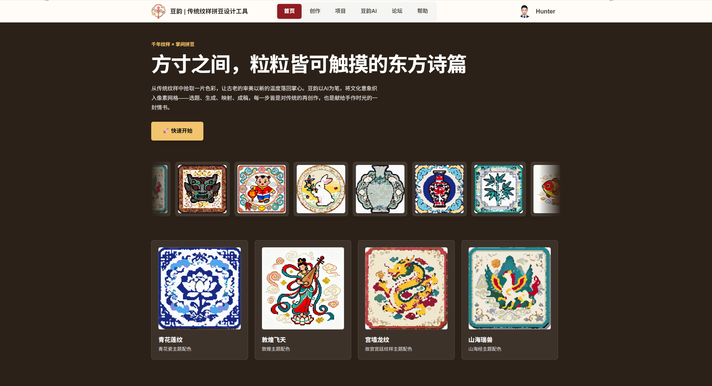

首页预览展示了网站的整体视觉方向：品牌标题、导航入口、传统文化参考图、创作流程说明和社区入口共同构成第一屏体验。README 将首页截图单独放在网站链接之后，是为了让读者先看到实际产品界面，再继续阅读设计理念和功能说明。截图文件已从根目录归纳到 `docs/images/pages/home-page.png`，并使用英文文件名，避免在不同系统、部署平台或 Markdown 渲染器中出现中文路径兼容问题。

## 参考图展示

<table>
  <tr>
    <td align="center" width="25%"><strong>敦煌飞天</strong><br /></td>
    <td align="center" width="25%"><strong>青花莲纹</strong><br /></td>
    <td align="center" width="25%"><strong>故宫龙纹</strong><br /></td>
    <td align="center" width="25%"><strong>传统瑞兽</strong><br />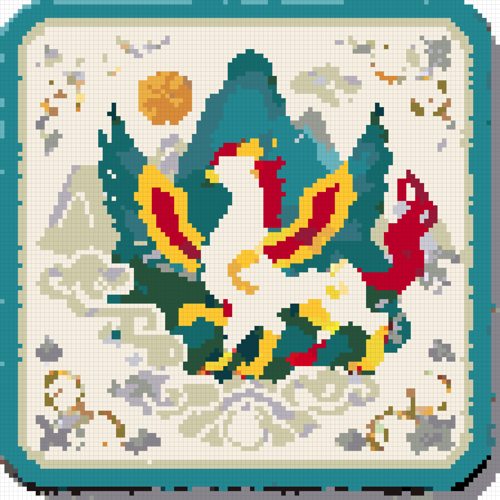</td>
  </tr>
  <tr>
    <td align="center" width="25%"><strong>月兔纹样</strong><br /></td>
    <td align="center" width="25%"><strong>汝窑冰裂</strong><br />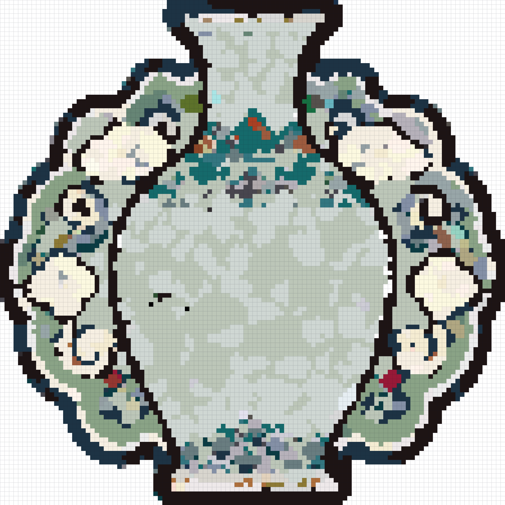</td>
    <td align="center" width="25%"><strong>竹影杯垫</strong><br /></td>
    <td align="center" width="25%"><strong>凤凰纹样</strong><br /></td>
  </tr>
</table>

参考图展示采用一致的四列结构和统一图片宽度，便于在 README 中形成整齐的视觉浏览区。这里展示的是项目内置 `public/showcase` 资源，覆盖敦煌、青花、宫廷纹样、瑞兽、节令、瓷器和自然意象等方向。它们用于说明豆阁希望生成的作品气质：图案既要保留传统文化的识别点，也要被控制在拼豆可制作的颗粒尺度、颜色数量和边缘结构之内，避免只追求复杂绘画效果而无法落地制作。

## 设计理念

拼豆是一种低门槛、强参与感、适合亲子、社群、研学和文创场景的手工形式；传统文化纹样则具有高辨识度、强符号性和丰富的审美来源。豆阁的设计目标是把两者连接起来，把青花瓷、敦煌、京剧脸谱、山海经、二十四节气、故宫纹样、四大名著等文化资源转化为适合拼豆颗粒表达的图案。AI 在这里负责生成视觉素材、理解主体和组织文化说明，用户仍保留主题、主体、提示词、颜色、网格和图纸的调整权，最终结果服务于真实制作，而不是停留在屏幕预览。

## 页面组成与功能

网站以首页、创作页、项目页、豆阁 AI、论坛、帮助页和个人主页构成完整产品闭环。首页负责建立品牌印象和示例入口；创作页承载核心制作流程；项目页沉淀个人作品；豆阁 AI 用于快速探索图像灵感；论坛用于分享与导入模板；帮助页解释操作和问题；个人主页集中管理用户身份、头像、模型配置和保存偏好。每个页面都围绕“从文化灵感到可制作图纸”展开，避免让用户在生成图片、整理材料和查找说明之间反复跳转。

### 首页


首页是整个网站的入口和视觉展示页。顶部导航包含首页、创作、项目、豆阁 AI、论坛、帮助和用户入口；首屏展示品牌标语、快速开始按钮和主要视觉图；滚动参考图展示 `public/showcase` 中的传统文化拼豆底稿；制作流程区用四个步骤说明从文化主题到拼豆底稿的过程；论坛入口以多张参考图横向展示，引导进入作品分享页面。首页强调“看得懂、点得进、马上能创作”，因此视觉上优先呈现作品，而不是大段介绍文字。

### 创作页

创作页是核心工作区，由配置、主体提取与 AI 再创作、拼豆图纸、制作方案四个步骤组成。用户可以从传统主题开始，也可以上传已有图片作为再创作模板；系统会在不同阶段提供图像生成、主体识别、颜色分析、像素化、材料统计和文化说明能力。这个页面的设计重点是让每一步的输入和输出都清晰可见，用户既能快速走完整个流程，也能在主体识别、提示词和颜色图纸上进行细致修改。

#### 第一步：配置

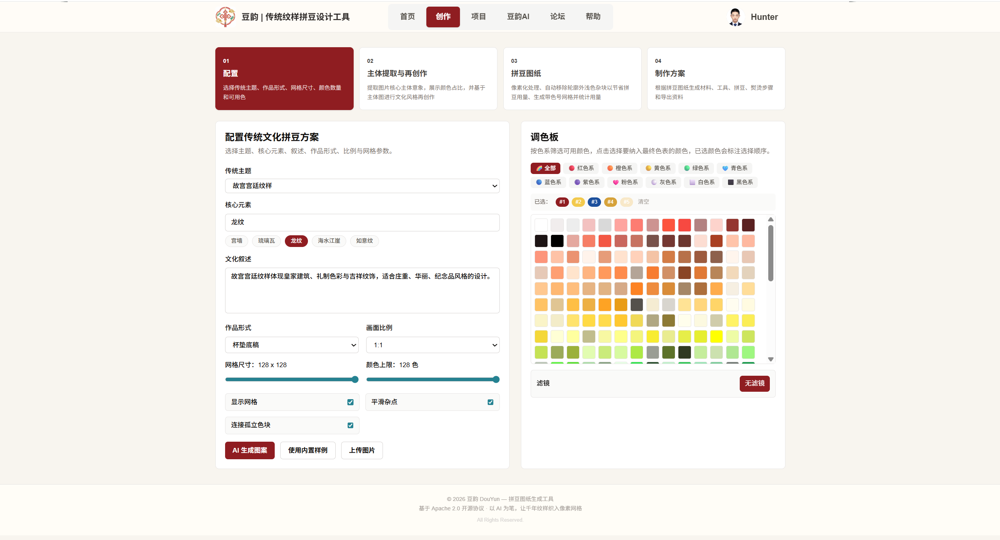

第一步用于确定作品的基础参数，包括传统文化主题、核心元素、文化叙述、作品形式、画面比例、网格尺寸、颜色上限、网格显示、杂点平滑和可用颜色范围。作品形式覆盖杯垫、挂件、冰箱贴、胸针、吊饰、随身牌等常见拼豆场景，内置主题覆盖敦煌文化、青花瓷、京剧脸谱、山海经、二十四节气、甲骨文、三星堆、宋代瓷器、汉服纹样、苗绣、壮锦、剪纸、皮影戏、景泰蓝、商周青铜器、故宫宫廷纹样、苏州园林、水墨山水、传统瑞兽、十二生肖、年画与春节、端午文化、中秋文化、中国茶文化、红楼梦、西游记、三国演义、水浒传、诗词书法等方向。

#### 第二步：主体提取与 AI 再创作

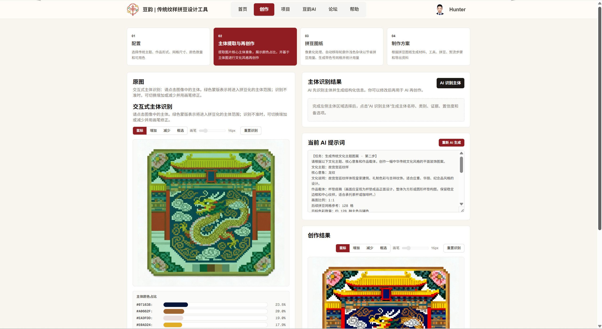

第二步处理原始素材和文化风格再创作。上传图片后，系统默认把整张原图作为主体模板，避免主体未被选中导致无法识别；用户仍可以用选择、增加、减少、框选等工具修改主体区域。系统会统计主体颜色占比，并把这些颜色信息作为后续再创作的参考。AI 识别主体会返回主体名称、类别、视觉证据、置信度、备选项和视觉摘要，识别结果支持编辑；再创作提示词也会显示为可编辑文本框，用户修改后可以重新生成，使 AI 输出更贴近用户确认过的主体和色彩结构。

#### 第三步：拼豆图纸

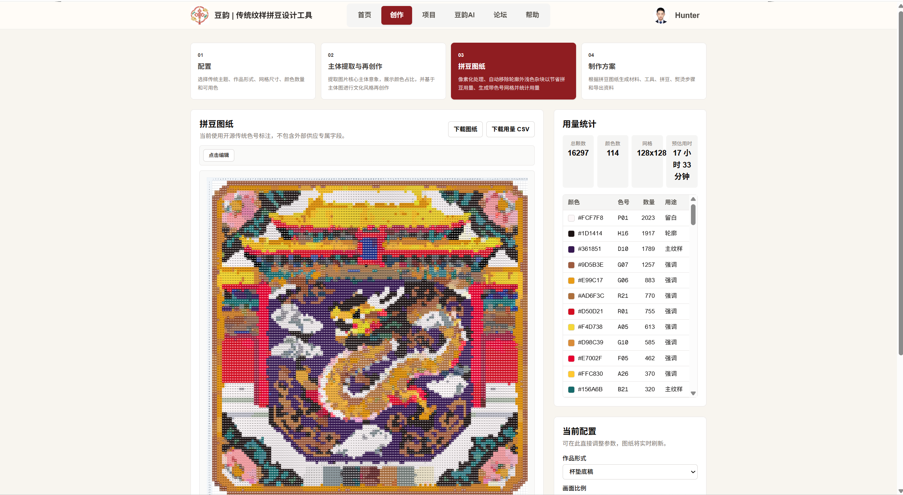

第三步把再创作结果转成可制作的拼豆图纸。系统会将图像按网格尺寸像素化，使用开源色表映射到最近可用颜色，按颜色数量上限合并相近颜色，并对外部浅色背景做连通区域识别，标记为非主体区域。用户可以查看带色号、行列号和网格线的图纸，也可以点击颜色高亮同色格，便于实际摆豆。材料统计会展示每种颜色的用量和占比，减少制作时临时估算、反复数格和颜色混淆的问题。

#### 第四步：制作方案

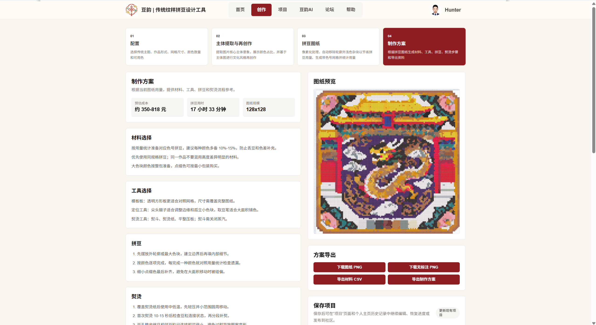

第四步输出最终制作资料，包括作品标题、拼豆图纸、无标注图、材料清单、文化说明、制作步骤、工具准备、熨烫建议、时间估算和成本估算。文化说明会读取图像、主体识别结果和材料颜色，尽量避免只套用第一步配置主题；AI 文化文案提示词同样可编辑，用户可以修改后重新生成。导出功能面向真实手工场景，支持下载带网格图纸 PNG、无标注 PNG、材料 CSV 和制作方案文本，方便课堂分发、社群活动和个人留档。

### 项目页

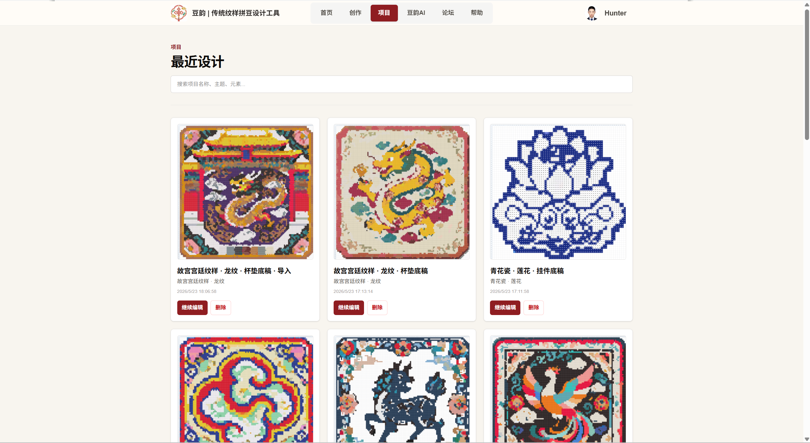

项目页用于管理本地作品，支持自动保存、手动保存、搜索项目标题、筛选主题元素、继续编辑、删除和新建项目。项目数据使用浏览器本地存储和 IndexedDB 保存，能够容纳较大的图像 data URL，并区分登录用户与匿名用户的项目记录。这个页面解决的是“作品不会只做一次”的问题：用户可能需要暂停、回看、复制旧方案、重新调整颜色或导出不同版本，因此项目页提供了创作历史的组织能力。

### 豆阁 AI 页面

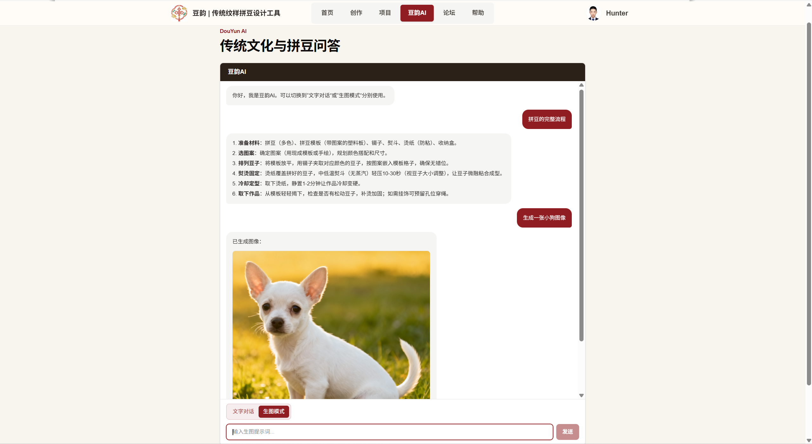

豆阁 AI 是独立的图像生成入口，适合在正式进入四步创作流程之前探索视觉灵感。用户可以输入生图提示词，服务端调用 Ark 图像生成接口，生成结果以聊天消息形式展示，历史消息保存在浏览器本地。它与创作页的区别在于更自由、更轻量：用户可以先尝试不同传统意象、构图和色彩方向，再把满意的图像作为后续拼豆图纸的素材来源，减少正式制作前的试错成本。

### 论坛页

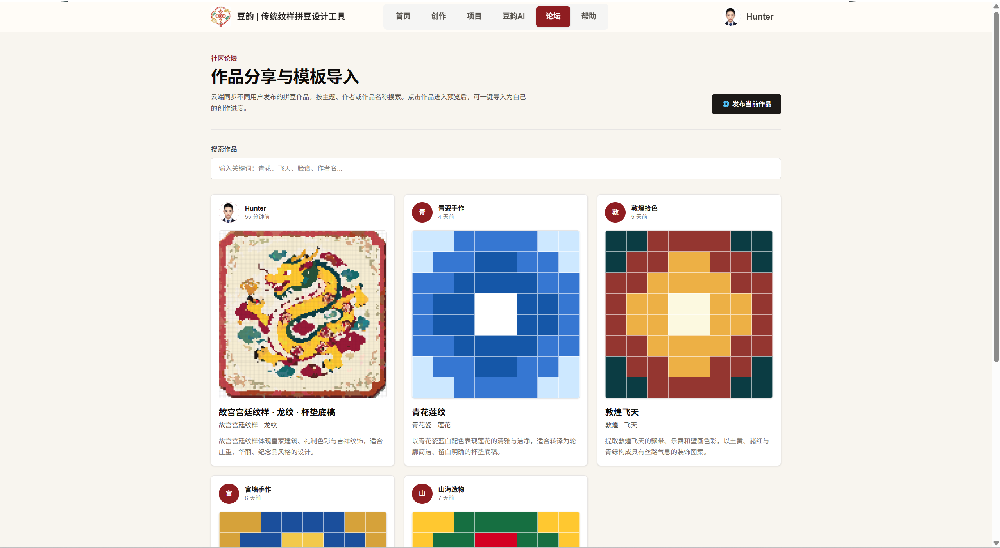

论坛页用于作品分享和模板导入，展示内置模板和云端社区作品，支持按标题、主题、作者和元素搜索。用户可以发布当前作品到论坛，也可以点击作品查看大图、主题、元素、文化说明和推荐配色，并一键导入为自己的可编辑项目。论坛的价值不只是展示成品，还在于形成可复用的创作素材库：新用户可以从已有模板开始学习，熟练用户可以把自己的设计沉淀为其他人可继续改造的公共参考。

### 帮助页

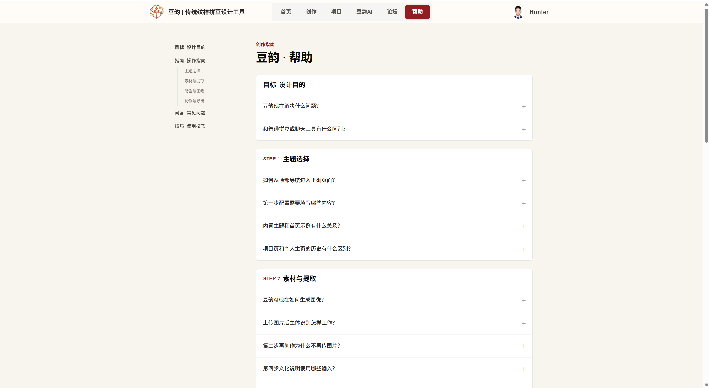

帮助页提供完整说明，覆盖设计目的、操作指南、常见问题、使用技巧、中英文内容切换、侧边目录和移动端快速导航。它面向第一次使用网站的用户，也面向课堂、社群和工作坊的组织者，因此说明需要同时解释“怎么点”“为什么这样做”和“遇到问题如何处理”。帮助页会把创作流程拆成可执行动作，减少用户在主体识别、图纸导出、颜色统计和模型配置上的理解成本。

### 个人主页

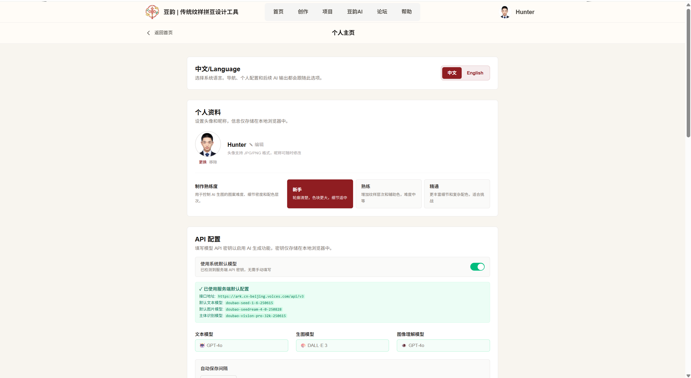

个人主页管理用户和配置，包括注册、登录、用户昵称、系统头像、上传头像、裁剪头像、API 配置、模型选择、自动保存间隔、用户技能等级、项目历史查看和作品管理。用户可以选择使用系统默认模型，也可以手动填写文本模型、图像模型和图像理解模型配置。这个页面把偏好设置集中在一起，避免创作过程中频繁打断；同时也让不同用户在同一浏览器中拥有相对独立的项目记录和 AI 配置。

## 关键工作流

豆阁的关键工作流围绕三条路径展开：从主题直接生成图案、从本地图片上传再创作、从再创作结果生成拼豆图纸。三条路径共享同一套颜色映射、主体区域和材料统计逻辑，保证用户无论从哪个入口开始，最终都能进入可制作的图纸和方案输出。工作流设计强调可解释的中间结果：用户可以看到主体识别、提示词、图像结果、像素网格和材料用量，而不是只得到一个无法修改的最终图片。

### AI 生成图案工作流

AI 生成图案工作流从用户选择主题、元素、作品形式、比例和配色开始，前端调用 `/api/generate-culture-image`，服务端根据配置构造传统文化图案提示词，再由 Ark 图像生成接口返回图像。生成结果进入第二步后，用户可以继续确认主体、修改提示词或生成拼豆图纸。这个流程适合没有现成图片、但已经有明确文化方向的用户，例如想做敦煌飞天杯垫、青花莲纹挂件或红楼梦意象冰箱贴的场景。

### 上传图片再创作工作流

上传图片再创作工作流适合用户已经有照片、插画或参考图的情况。系统会默认整张图为主体模板并生成颜色占比，用户可以修改主体区域，然后调用 `/api/identify-subject` 识别主体，并在前端编辑结构化识别结果。确认后，`/api/extract-theme-image` 会根据主体信息、颜色组成和目标文化风格重新生成图像；再创作结果自动识别边缘以内区域作为主体，继续进入拼豆图纸生成。这条路径把用户原图的结构和色彩纳入 AI 创作，而不是把上传图当成普通附件。

### 拼豆图纸生成工作流

拼豆图纸生成工作流读取再创作结果中的主体图像，按指定网格尺寸采样像素，映射到开源色表，限制颜色数量并合并近似颜色，清理外部背景和杂点，最后渲染带色号、行列号和网格线的图纸。系统还会统计颜色用量并生成导出资料，帮助用户准备材料和实际摆豆。这个流程的核心不是追求最大程度还原原图，而是在有限网格、有限颜色和真实手作条件下保留主体辨识度与文化特征。

## API 路由

| 路由 | 功能 |
|---|---|
| `/api/generate-culture-image` | 根据主题配置生成传统文化图案 |
| `/api/identify-subject` | 使用多模态文本模型识别图像主体，返回结构化 JSON |
| `/api/extract-theme-image` | 根据主体识别结果和颜色组成进行文化风格再创作 |
| `/api/generate-culture-text` | 根据图像、主体识别和材料数据生成文化说明 |
| `/api/generate-product-scene` | 生成产品场景预览 |
| `/api/chat` | 豆阁 AI 聊天式生图接口 |
| `/api/community-posts` | 云端社区作品读取和发布 |
| `/api/env-config` | 返回服务端模型配置状态 |
| `/api/matting` | 图像抠图辅助接口 |

API 路由集中在 `src/app/api` 下，承担图像生成、主体识别、文化再创作、文化说明、产品场景、社区作品和环境配置等服务端能力。前端不会把复杂提示词、模型密钥或图片压缩逻辑分散在页面组件里，而是通过这些路由形成清晰边界。这样既便于后续替换模型，也便于定位问题：如果图像生成异常就检查生图路由，如果主体识别异常就检查识别路由，如果社区数据异常就检查论坛接口。

## 关键技术

豆阁结合了 Next.js、React、TypeScript、Tailwind CSS、Canvas 图像处理、服务端图片压缩、IndexedDB、本地存储和 Ark AI 模型接口。技术选型围绕两个目标展开：一是让网站在浏览器中完成足够多的交互式图像编辑和图纸渲染，二是把需要模型能力的部分放在服务端 API 中统一处理。整体架构尽量保持前端可交互、服务端可替换、数据可保存、导出可落地，避免把拼豆制作变成只适合演示的单次生成流程。

### 前端

前端使用 Next.js 15 App Router 作为页面、API 路由和构建框架，React 19 负责组件状态、交互流程和局部视图切换，TypeScript 描述主题、项目记录、颜色、图纸和社区数据类型，Tailwind CSS 4 负责界面布局、响应式设计和视觉样式。项目还接入 `next-pwa` 提供渐进式应用能力，并使用 Vercel Analytics 做访问分析。前端组件重点承载创作步骤、主体编辑器、图纸画布、论坛列表和个人配置等高交互界面。

### 图像处理

图像处理主要依赖 Browser Canvas API 和服务端 Sharp。Canvas 用于读取图像、生成 mask、像素采样、绘制图纸、导出 PNG、分析主体颜色和处理用户在主体编辑器中的操作；Sharp 用于服务端压缩 data URL 图片，降低多模态接口输入体积。主体 mask 支持自动检测、整图选择、空选区、点击连通区域、笔刷增减和框选识别，使上传图片、AI 结果和最终拼豆图纸之间保持一致的主体区域语义。

### 颜色和像素算法

颜色和像素算法负责把连续图像转成有限颜色、有限格子的拼豆图纸。系统会对每个格子进行主导色采样，使用颜色距离寻找最接近的开源色表颜色，再根据颜色数量上限合并近似颜色，而不是简单丢弃低频颜色。外部背景识别从边界浅色区域开始做连通识别，标记为非主体区域；杂点处理用于减少实际摆豆时的零散单格；色号显示则让每个非外部格子都能对应到材料清单，方便用户照图制作。

### AI 能力

AI 能力包括图像生成、主体识别、文化再创作和文化说明生成。图像生成调用 Ark 图片生成模型；主体识别使用与文化说明一致的多模态文本模型看图，并返回严格 JSON；文化再创作会把用户确认后的主体识别、颜色组成和产品形式转为图像生成提示词；文化说明会读取图像、主体识别结果、材料颜色和产品形式，生成作品介绍。第二步和第四步都显示当前提示词，用户可以编辑后重新生成，保证 AI 输出可以被人工控制和修正。

### 数据存储

数据存储分为轻量配置和项目历史两类。`localStorage` 保存语言、用户配置、API 配置、AI 聊天历史等轻量数据；IndexedDB 保存项目历史，支持较大的图像 data URL 和多用户项目隔离；云端社区接口用于发布和读取论坛作品。这样的存储策略让普通创作不依赖服务端账号也能保存进度，同时保留社区分享能力。对手工创作网站来说，保存中间过程很重要，因为用户常常需要分多次调整图纸、材料和说明。

## 项目结构

```text
src/
  app/
    api/                     # 服务端 API 路由
    page.tsx                 # 首页入口
    layout.tsx               # 元数据与全局布局
    globals.css              # Tailwind 与全局动画
  components/
    CreativeBeadStudio.tsx   # 主应用组件和页面视图
    SubjectMaskEditor.tsx    # 主体区域编辑器
    ProfilePage.tsx          # 个人主页与 API 配置
    ai/                      # 豆阁 AI 面板组件
  data/
    cultureThemes.ts         # 传统文化主题数据
    productTemplates.ts      # 产品形式模板
    aspectRatios.ts          # 画面比例配置
  utils/
    culturePattern.ts        # 拼豆图纸生成与渲染
    subjectAnalysis.ts       # 主体 mask 与颜色分析
    pixelation.ts            # 像素采样和颜色映射
    profileStorage.ts        # 用户、配置和项目存储
    communityForum.ts        # 社区作品接口封装
public/
  showcase/                  # 首页和示例参考图
  logo.png                   # 品牌 logo
docs/
  images/
    pages/                   # README 页面截图，统一英文命名
```

项目结构以 Next.js App Router 为核心，页面入口、API 路由、全局样式、核心组件、主题数据、产品模板、图像算法和存储封装各自分区。`CreativeBeadStudio.tsx` 承担主要页面视图和创作流程编排，`SubjectMaskEditor.tsx` 负责主体区域编辑，`culturePattern.ts` 和 `pixelation.ts` 负责拼豆图纸生成，`profileStorage.ts` 与 `communityForum.ts` 负责本地和社区数据。README 页面截图统一放入 `docs/images/pages`，避免根目录堆积展示资源。

## 环境变量

本地可创建 `.env.local`：

```bash
ARK_API_KEY=你的 Ark API Key
ARK_BASE_URL=https://ark.cn-beijing.volces.com/api/v3
AI_TEXT_MODEL=doubao-seed-1-6-250615
AI_IMAGE_MODEL=doubao-seedream-4-0-250828
AI_VISION_MODEL=可选，当前主体识别默认复用文本多模态模型
```

环境变量用于连接服务端 AI 能力，其中 `/api/generate-culture-image` 使用图像生成模型，`/api/identify-subject` 当前复用文本多模态模型看图，`/api/generate-culture-text` 使用文本多模态模型生成文化说明。个人主页也提供模型配置入口，用户可以选择使用系统默认模型或手动填写模型信息。把模型参数放在环境变量和个人配置中，可以避免把密钥写进前端代码，同时也方便部署环境与本地开发环境使用不同模型。

## 快速开始

```bash
npm install
npm run dev
```

浏览器打开：

```text
http://localhost:3000
```

生产构建：

```bash
npm run build
npm run start
```

快速开始流程面向本地开发和演示验证。首次运行需要安装依赖，然后通过 `npm run dev` 启动开发服务器；如果需要验证生产环境行为，可以执行 `npm run build` 和 `npm run start`。涉及 AI 图像生成、主体识别和文化说明的功能需要正确配置 Ark 相关环境变量，否则只能查看静态页面、前端交互和不依赖模型的基础流程。线上体验地址为 `https://douyun-huazhang-3g29.vercel.app/`。

## 典型使用方式

典型使用方式分为从传统主题开始、从本地图片开始和从论坛作品开始三类。三种入口对应不同用户习惯：有人先有文化主题，有人先有参考图片，也有人希望从他人作品继续改造。豆阁把这些入口统一到同一套四步创作流程中，最终都能生成拼豆图纸、材料清单和制作方案。这样的设计适合个人兴趣创作，也适合教师或活动组织者提前准备模板，再让参与者现场调整和制作。

### 从传统主题开始

从传统主题开始时，用户进入创作页，选择传统主题和核心元素，设置作品形式、比例、网格和颜色数量，然后点击 AI 生成图案。生成结果进入后续步骤后，可以继续识别主体、调整提示词、生成拼豆图纸并导出资料。这个流程适合目标明确但没有参考图的情况，例如要围绕端午、中秋、故宫龙纹、敦煌飞天或四大名著人物意象制作一组拼豆作品，用户只需要先描述文化方向。

### 从本地图片开始

从本地图片开始时，用户上传图片，系统默认整图作为主体模板，并生成主体颜色占比。用户可以点击 AI 识别主体，必要时手动修改识别结果，再通过 AI 再创作生成传统文化风格图案。之后系统会生成拼豆图纸、文化说明和制作方案。这个流程适合把个人照片、已有插画、课堂素材或线下文创参考图转成拼豆图纸，重点是保留原图的主体结构和颜色组成，同时加入更明确的文化表达。

### 从论坛作品开始

从论坛作品开始时，用户进入论坛页，浏览或搜索作品，打开作品详情后可以查看大图、主题、元素、文化说明和推荐配色，并一键导入为自己的项目。导入后，用户可以继续修改主题、配色、网格和图纸，而不是只能下载静态图片。这个流程适合新用户学习已有模板，也适合社群活动中统一发放基础方案，再让每个参与者根据自己的材料和审美进行二次创作。

## 色板数据

色板数据位于：

```text
src/app/colorSystemMapping.json
```

每个 hex 色值对应三类开源标注：`heritage` 表示传统色号，`palette` 表示配色编号，`sequence` 表示顺序编号。这些字段只用于图纸展示和统计，不包含外部供应、购买或销售推荐语义。色板数据是拼豆图纸能够落地的重要基础，因为 AI 生成图像通常包含连续渐变和大量细微颜色，而实际拼豆制作需要收敛到有限的可识别颜色。通过统一色板，图纸、材料清单和色号展示才能保持一致。

## 常见问题

常见问题用于集中说明线上访问、模型配置、本地运行和功能边界等容易影响首次体验的事项。豆阁同时包含静态展示、浏览器端图像处理、本地项目存储和服务端 AI 调用，不同问题可能来自网络、浏览器、环境变量或模型权限。把这些说明放在 README 中，可以让使用者在进入网站前先了解排查顺序，也便于教师、社群组织者或部署维护者提前准备网络环境、API 配置和本地备用方案。

### 为什么线上网站有时打不开？

README 顶部保留的 `https://douyun-huazhang-3g29.vercel.app/` 是上游历史演示地址，不是本 RBCC 仓库的独立部署地址。如果浏览器无法进入页面，可能与历史部署状态或当前网络环境有关。若本地开发环境已经配置好依赖和环境变量，可以通过 `npm run dev` 在本机启动项目，并使用 `http://localhost:3000` 访问。

### 为什么 AI 功能需要配置模型？

AI 图像生成、主体识别、文化再创作和文化说明都依赖服务端模型接口，因此部署环境需要提供 Ark API Key、基础地址和模型名称。没有配置模型时，页面结构、示例图、项目管理和部分本地交互仍可查看，但涉及实际生图和看图理解的功能无法完成。项目把模型配置集中在环境变量和个人主页中，是为了让本地开发、线上部署和不同用户自定义模型都能使用同一套前端流程，同时避免把密钥暴露在浏览器代码里。

## 当前适用场景

豆阁当前适用于传统文化主题拼豆创作、文创产品概念设计、中小学课程、博物馆教育、非遗研学、亲子手作、社群活动、兴趣工作坊，以及拼豆图纸算法和 AI 辅助设计的开源研究。它特别适合需要“讲清文化来源并做出实物”的场景：用户不仅能获得好看的图案，还能得到主体说明、文化寓意、材料清单和制作步骤。对于教学场景，教师可以用它快速生成不同主题模板；对于个人创作，用户可以把灵感转化为可执行的手工方案。

## 开源说明

豆阁面向拼豆爱好者、教师、学生、设计师和开源开发者。欢迎继续扩展更多传统文化主题、更多产品形式模板、更精细的颜色映射策略、更丰富的导出格式、更完整的社区作品管理，以及更稳定的 AI 模型配置体验。项目后续可以继续加强移动端创作效率、作品发布审核、多人协作、材料采购清单和线下课程包导出等方向。贡献时建议保持“文化表达、手工可制作、AI 可编辑”三者一致，不把生成图片作为唯一目标。

